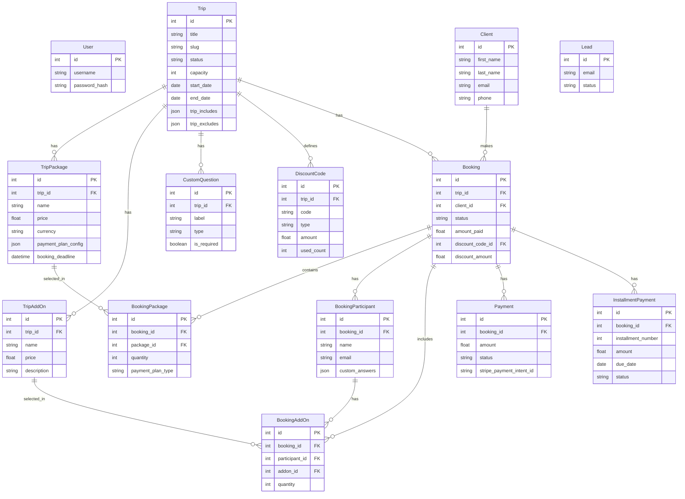
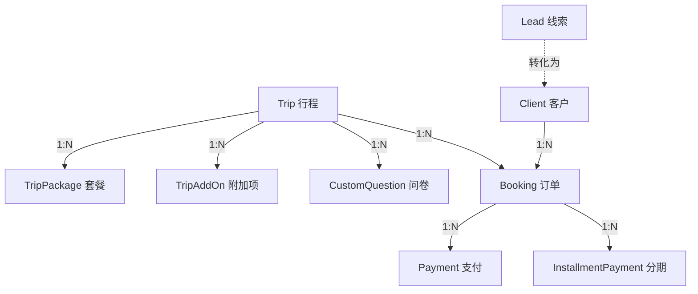

# 数据库设计

本文档详细说明 NH Tours 项目的数据库结构、设计逻辑和变更历史。

## 目录

- [实体关系图](#实体关系图)
- [核心模型详解](#核心模型详解)
- [设计逻辑通俗解释](#设计逻辑通俗解释)
- [变更历史](#变更历史)

---

## 实体关系图



---

## 核心模型详解

### Trip（行程）

核心模型，存储行程基础信息。

| 字段 | 类型 | 说明 |
|------|------|------|
| `status` | String | `draft` / `published` / `archived` |
| `capacity` | Integer | 最大名额 |
| `trip_includes` | JSON | 包含项列表 |
| `trip_excludes` | JSON | 不包含项列表 |
| `hero_image` | String | 封面图路径 |
| `color` | String | 日历展示颜色 |

### TripPackage（套餐）

定义价格和支付方式。

| 字段 | 类型 | 说明 |
|------|------|------|
| `price` | Float | 单价 |
| `currency` | String | 货币（USD/CNY/CAD） |
| `payment_plan_config` | JSON | 支付计划配置 |
| `booking_deadline` | DateTime | 报名截止日期 |

**payment_plan_config 结构示例**:

```json
{
    "enabled": true,
    "deposit_amount": 500,
    "installments": [
        {"date": "2025-06-01", "amount": 1000},
        {"date": "2025-07-01", "amount": 1000}
    ],
    "enable_auto_billing": false
}
```

### Booking（预订）

连接 Client 和 Trip 的交易记录。

| 字段 | 类型 | 说明 |
|------|------|------|
| `status` | String | `pending` / `deposit_paid` / `fully_paid` / `cancelled` |
| `amount_paid` | Float | 已支付金额（不含 Stripe 手续费） |
| `discount_code_id` | FK | 使用的折扣码 |
| `discount_amount` | Float | 折扣金额 |
| `buyer_*` | Various | 购买者信息字段 |

**购买者信息字段**:
- `buyer_first_name`, `buyer_last_name`, `buyer_email`, `buyer_phone`
- `buyer_address`, `buyer_city`, `buyer_state`, `buyer_zip_code`, `buyer_country`
- `buyer_emergency_contact_*`: 紧急联系人
- `buyer_custom_info`: JSON 格式存储自定义字段答案

### Payment（支付记录）

每笔支付的详细记录。

| 字段 | 类型 | 说明 |
|------|------|------|
| `amount` | Float | 支付金额（含手续费） |
| `status` | String | `pending` / `succeeded` / `failed` / `refunded` |
| `stripe_payment_intent_id` | String | Stripe PI ID |
| `base_amount_cents` | Integer | 基础金额（分） |
| `fee_cents` | Integer | 手续费（分） |
| `final_amount_cents` | Integer | 最终金额（分） |

### InstallmentPayment（分期付款）

分期付款记录。

| 字段 | 类型 | 说明 |
|------|------|------|
| `installment_number` | Integer | 0=定金, 1-N=分期 |
| `amount` | Float | 本期金额 |
| `due_date` | Date | 到期日期 |
| `status` | String | `pending` / `paid` / `overdue` / `cancelled` |
| `reminder_sent` | Boolean | 是否已发送提醒 |

### PendingBooking（待处理预订）

临时存储预订数据，支付成功后才创建正式 Booking。

| 字段 | 类型 | 说明 |
|------|------|------|
| `booking_data` | Text | JSON 格式完整预订数据 |
| `stripe_payment_intent_id` | String | 关联的 PI ID |
| `status` | String | `pending` / `completed` / `expired` |
| `expires_at` | DateTime | 过期时间 |

---

## 设计逻辑通俗解释

将数据库比作一间旅行社的档案管理系统：

### 角色对应

| 数据表 | 比喻 | 说明 |
|--------|------|------|
| **Trip** | 产品宣传册 | 写明行程名称、日期、价格方案 |
| **TripPackage** | 价格标签 | "普通座 $2000"、"VIP座 $5000" |
| **Client** | 客户通讯录 | 不管有没有报名，咨询过就记录 |
| **Booking** | 签署的合同 | 把"人"和"产品"连在一起 |
| **Payment** | 财务收据 | 证明客户真的付钱了 |

### JSON 字段的用途

`payment_plan_config` 就像价签背后的"分期说明书"：
- 有的价签写着"可以分3期付"
- 有的写着"必须一次付清"
- 我们把这些复杂说明打包封在一个格子里

### 为什么这么设计？

- **灵活性**: 改动行程日期，只改 Trip 表，所有报名自动更新
- **清晰账目**: 查某客户花了多少钱 → 翻 Payment；查行程剩余位子 → 数 Booking

---

## 变更历史

### 2026-01-21: 支付字段扩展

为支付对账与报表，`Payment` 新增结构化字段：
- `funding`, `brand`: 卡类型和品牌
- `base_amount_cents`, `fee_cents`, `final_amount_cents`: 金额明细

### 2026-01-20: Discount Code 功能

- `DiscountCode`: 新增 `used_count` 字段
- `Booking`: 新增 `discount_code_id`, `discount_amount` 字段

### 2026-01-20: 延迟创建 Booking

新增 `PendingBooking` 模型，支付成功后才创建正式 Booking。

### 2026-01-XX: 分期付款模块

- 新增 `InstallmentPayment` 模型
- `Payment` 扩展: 新增 `booking_id`, `installment_payment_id` 等字段

### Phase 2 初始: 核心模型

- `Lead`: 存储 Contact 表单数据
- `Booking`: 管理预订记录
- `Trip`: 新增 `status`, `capacity` 字段

---

## 数据库关系图谱



---

## 更新日期

**最后更新**: 2026-01-21
