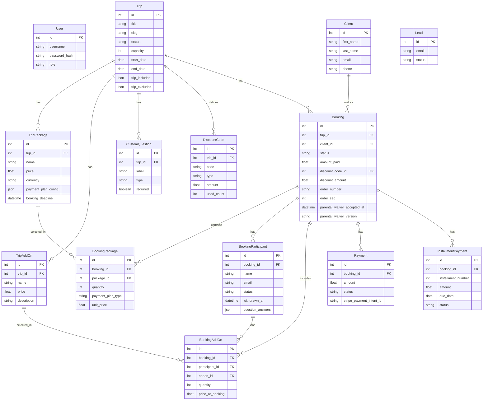
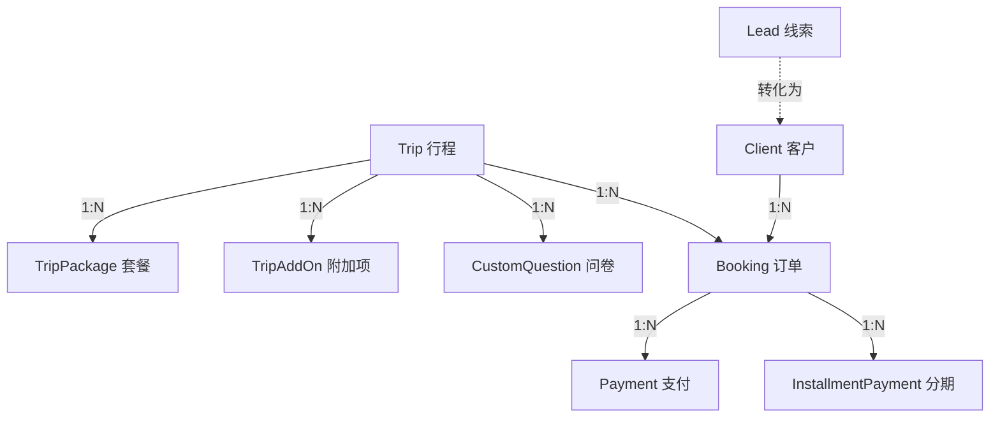

# 数据库设计

本文档详细说明 NH Tours 项目的数据库结构、设计逻辑和变更历史。

## 目录

- [实体关系图](#实体关系图)
- [核心模型详解](#核心模型详解)
- [设计逻辑通俗解释](#设计逻辑通俗解释)
- [变更历史](#变更历史)

---

## 实体关系图


```mermaid
erDiagram
    User {
        int id PK
        string username
        string password_hash
        string role
    }
    Trip {
        int id PK
        string title
        string slug
        string status
        int capacity
        date start_date
        date end_date
        json trip_includes
        json trip_excludes
    }
    TripPackage {
        int id PK
        int trip_id FK
        string name
        float price
        string currency
        json payment_plan_config
        datetime booking_deadline
    }
    TripAddOn {
        int id PK
        int trip_id FK
        string name
        float price
        string description
    }
    CustomQuestion {
        int id PK
        int trip_id FK
        string label
        string type
        boolean required
    }
    DiscountCode {
        int id PK
        int trip_id FK
        string code
        string type
        float amount
        int used_count
    }
    Client {
        int id PK
        string first_name
        string last_name
        string email
        string phone
    }
    Booking {
        int id PK
        int trip_id FK
        int client_id FK
        string status
        float amount_paid
        int discount_code_id FK
        float discount_amount
        string order_number
        int order_seq
        datetime parental_waiver_accepted_at
        string parental_waiver_version
    }
    BookingPackage {
        int id PK
        int booking_id FK
        int package_id FK
        int quantity
        string payment_plan_type
        float unit_price
    }
    BookingParticipant {
        int id PK
        int booking_id FK
        string name
        string email
        string status
        datetime withdrawn_at
        json question_answers
    }
    BookingAddOn {
        int id PK
        int booking_id FK
        int participant_id FK
        int addon_id FK
        int quantity
        float price_at_booking
    }
    Payment {
        int id PK
        int booking_id FK
        float amount
        string status
        string stripe_payment_intent_id
    }
    InstallmentPayment {
        int id PK
        int booking_id FK
        int installment_number
        float amount
        date due_date
        string status
    }
    Lead {
        int id PK
        string email
        string status
    }

    Trip ||--o{ TripPackage : "has"
    Trip ||--o{ TripAddOn : "has"
    Trip ||--o{ CustomQuestion : "has"
    Trip ||--o{ DiscountCode : "defines"
    Trip ||--o{ Booking : "has"
    Client ||--o{ Booking : "makes"
    Booking ||--o{ BookingPackage : "contains"
    Booking ||--o{ BookingParticipant : "has"
    Booking ||--o{ BookingAddOn : "includes"
    Booking ||--o{ Payment : "has"
    Booking ||--o{ InstallmentPayment : "has"
    TripPackage ||--o{ BookingPackage : "selected_in"
    TripAddOn ||--o{ BookingAddOn : "selected_in"
    BookingParticipant ||--o{ BookingAddOn : "has"
```

---

## 核心模型详解

### Trip（行程）

核心模型，存储行程基础信息。

| 字段 | 类型 | 说明 |
|------|------|------|
| `status` | String | `draft` / `published` / `archived` / `deactivated` |
| `capacity` | Integer | 最大名额 |
| `registration_date` | Date | 报名开放日期，None 表示不限制 |
| `trip_abbr` | String(8) | 业务单号缩写（如 `MT`）；Basics 可编辑；只影响新单 |
| `teacher_view_slug` | String(64), unique, nullable | 老师只读名单分享码；`/teacher/trips/<slug>`；Reset 换码即吊销 |
| `next_order_seq` | Integer | 下一单序号（取消不回收） |
| `trip_includes` | JSON | 包含项列表 |
| `trip_excludes` | JSON | 不包含项列表 |
| `hero_image` | String | 封面图路径 |
| `color` | String | 日历展示颜色 |

### TripPackage（套餐）

定义价格和支付方式。

| 字段 | 类型 | 说明 |
|------|------|------|
| `price` | Float | 单价 |
| `currency` | String | 货币（USD/CNY/CAD） |
| `payment_plan_config` | JSON | 支付计划配置 |
| `booking_deadline` | DateTime | 报名截止日期 |

**payment_plan_config 结构示例**:

```json
{
  "enabled": true,
  "allow_full_payment": true,
  "deposit_amount": 500,
  "installments": [
    {"date": "2025-09-03", "amount": 750},
    {"date": "2025-10-03", "amount": 750}
  ],
  "allow_partial": false
}
```

- Package = 产品（人群/价位），`price` 为唯一标价；开启分期时 deposit+各期须等于 `price`
- `allow_full_payment` 缺省视为 true：客户可在该产品内选全款或该套分期
- `BookingPackage.payment_plan_type`：`full` | `deposit_installment`（一单可混选多产品、不同付款方式）

> 历史键 `enable_auto_billing`：Builder UI 已移除（2026-07-27）；勿再配置。

### Booking（预订）

连接 Client 和 Trip 的交易记录。

| 字段 | 类型 | 说明 |
|------|------|------|
| `status` | String | `pending` / `deposit_paid` / `fully_paid` / `cancelled` |
| `amount_paid` | Float | 已支付金额（不含 Stripe 手续费） |
| `discount_code_id` | FK | 使用的折扣码 |
| `discount_amount` | Float | 折扣金额 |
| `order_number` | String(32) unique | 业务单号快照，如 `2607MT-001`；创建后永不改 |
| `order_seq` | Integer | 该 trip 内序号 |
| `buyer_*` | Various | 购买者信息字段 |

**业务单号格式**: `{YYMM}{ABBR}-{SEQ}`（出发年月 + `trip_abbr` + 三位序号）。在 Stripe 成功 / `create-free` / 后台 Manual Booking 创建正式 Booking 时分配；PendingBooking 不生成。逻辑见 `app/order_numbers.py`。

**购买者信息字段**:
- `buyer_first_name`, `buyer_last_name`, `buyer_email`, `buyer_phone`
- `buyer_address`, `buyer_city`, `buyer_state`, `buyer_zip_code`, `buyer_country`
- `buyer_emergency_contact_*`: 紧急联系人
- `buyer_custom_info`: JSON 格式存储自定义字段答案

### Payment（支付记录）

每笔支付的详细记录。

| 字段 | 类型 | 说明 |
|------|------|------|
| `amount` | Float | 支付金额（含手续费） |
| `status` | String | `pending` / `succeeded` / `failed` / `refunded` |
| `stripe_payment_intent_id` | String | Stripe PI ID |
| `base_amount_cents` | Integer | 基础金额（分） |
| `fee_cents` | Integer | 手续费（分） |
| `final_amount_cents` | Integer | 最终金额（分） |
| `refunded_amount` | Float | 已退基础金额（美元） |
| `receipt_email_sent_at` | DateTime, nullable | 收据邮件认领时间（防 status 轮询与 webhook 双发） |

### InstallmentPayment（分期付款）

分期付款记录。

| 字段 | 类型 | 说明 |
|------|------|------|
| `installment_number` | Integer | 0=定金, 1-N=分期 |
| `amount` | Float | 本期金额 |
| `due_date` | Date | 到期日期 |
| `status` | String | `pending` / `paid` / `overdue` / `cancelled` |
| `payment_intent_id` | String | Stripe PI ID |
| `payment_link` | String | 支付链接（可选） |
| `reminder_sent` | Boolean | 是否已发送提醒 |
| `reminder_count` | Integer | 提醒次数 |

### PendingBooking（待处理预订）

临时存储预订数据，支付成功后才创建正式 Booking。

| 字段 | 类型 | 说明 |
|------|------|------|
| `trip_id` | FK | 关联行程 |
| `payment_intent_id` | String | Stripe PaymentIntent ID（非 `stripe_payment_intent_id`） |
| `booking_data` | JSON | 完整预订数据 |
| `created_at` | DateTime | 创建时间 |
| `expires_at` | DateTime | 过期时间（可选，如 24h） |
| `status` | String | `pending` / `completed` / `expired` / `cancelled` |

### Testimonial（首页评价 / Post-trip Feedback）

首页轮播与 `/feedback` 提交共用此表，后台审核后 `approved` 条目按 `sort_order` 轮播。

| 字段 | 类型 | 说明 |
|------|------|------|
| `quote` | Text | 评价正文 |
| `author_name` | String | 作者姓名 |
| `organization` | String | 学校/机构（可选） |
| `status` | String | `pending` / `approved` / `rejected` |
| `sort_order` | Integer | 轮播顺序 |
| `source` | String | `homepage`（访客表单）/ `feedback`（行程结束页） |
| `email` | String | Feedback 来源邮箱 |
| `phone` | String | Feedback 来源电话 |
| `rating` | String | `excellent` / `very_good` / `good` / `fair` / `needs_improvement` |

### Message（行程消息）

后台 Trip manage 页发送邮件/通知；`recipient_config` 为 JSON 收件人规则。

> 另有 `City`、`BuyerInfoField` 等辅助表，详见 `models.py`。

---

## 设计逻辑通俗解释

将数据库比作一间旅行社的档案管理系统：

### 角色对应

| 数据表 | 比喻 | 说明 |
|--------|------|------|
| **Trip** | 产品宣传册 | 写明行程名称、日期、价格方案 |
| **TripPackage** | 价格标签 | "普通座 $2000"、"VIP座 $5000" |
| **Client** | 客户通讯录 | 不管有没有报名，咨询过就记录 |
| **Booking** | 签署的合同 | 把"人"和"产品"连在一起 |
| **Payment** | 财务收据 | 证明客户真的付钱了 |

### JSON 字段的用途

`payment_plan_config` 就像价签背后的"分期说明书"：
- 有的价签写着"可以分3期付"
- 有的写着"必须一次付清"
- 我们把这些复杂说明打包封在一个格子里

### 为什么这么设计？

- **灵活性**: 改动行程日期，只改 Trip 表，所有报名自动更新
- **清晰账目**: 查某客户花了多少钱 → 翻 Payment；查行程剩余位子 → 数 Booking

---

## 变更历史

### 2026-06-25: Testimonial Feedback 字段

- `Testimonial` 新增：`source`、`email`、`phone`、`rating`
- 迁移 head：`add_testimonial_feedback_fields`

### 2026-01-21: 支付字段扩展

为支付对账与报表，`Payment` 新增结构化字段：
- `funding`, `brand`: 卡类型和品牌
- `base_amount_cents`, `fee_cents`, `final_amount_cents`: 金额明细

### 2026-01-20: Discount Code 功能

- `DiscountCode`: 新增 `used_count` 字段
- `Booking`: 新增 `discount_code_id`, `discount_amount` 字段

### 2026-01-20: 延迟创建 Booking

新增 `PendingBooking` 模型，支付成功后才创建正式 Booking。

### 2026-01-XX: 分期付款模块

- 新增 `InstallmentPayment` 模型
- `Payment` 扩展: 新增 `booking_id`, `installment_payment_id` 等字段

### Phase 2 初始: 核心模型

- `Lead`: 存储 Contact 表单数据
- `Booking`: 管理预订记录
- `Trip`: 新增 `status`, `capacity` 字段

---

## 数据库关系图谱


```mermaid
graph TD
    Trip[Trip 行程]
    Pkg[TripPackage 套餐]
    Addon[TripAddOn 附加项]
    Q[CustomQuestion 问卷]
    
    Client[Client 客户]
    Booking[Booking 订单]
    Pay[Payment 支付]
    Inst[InstallmentPayment 分期]
    
    Lead[Lead 线索]

    Trip -->|1:N| Pkg
    Trip -->|1:N| Addon
    Trip -->|1:N| Q
    
    Client -->|1:N| Booking
    Trip -->|1:N| Booking
    
    Booking -->|1:N| Pay
    Booking -->|1:N| Inst
    
    Lead -.->|转化为| Client
```

---

## 更新日期

**最后更新**: 2026-07-27（User.role；payment_plan 去掉 auto_billing UI 说明）
