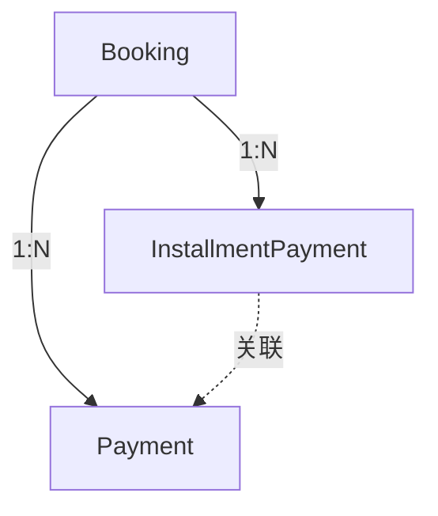

# 分期付款系统

本文档详细说明 NH Tours 的分期付款功能，包括数据流、Stripe 集成和 Payoff 逻辑。

## 目录

- [功能概述](#功能概述)
- [数据流](#数据流)
- [分期记录创建](#分期记录创建)
- [Payoff 一次性付清](#payoff-一次性付清)
- [提醒邮件](#提醒邮件)
- [Stripe Metadata 规范](#stripe-metadata-规范)

---

## 功能概述

### 分期付款流程

```
客户选择"定金 + 分期"支付
    ↓
支付定金（Installment #0）
    ↓
系统自动创建分期记录（Installment #1, #2, ...）
    ↓
到期前发送提醒邮件
    ↓
客户支付分期款项
    ↓
全部付清 → Booking status = fully_paid
```

### 状态定义

**InstallmentPayment.status**:

| 状态 | 说明 |
|------|------|
| `pending` | 待支付 |
| `paid` | 已支付 |
| `overdue` | 逾期 |
| `cancelled` | 已取消 |

**Booking.status**:

| 状态 | 说明 |
|------|------|
| `pending` | 未支付任何款项 |
| `deposit_paid` | 已支付定金，有待付分期 |
| `fully_paid` | 全部付清 |

---

## 数据流

### 首次支付（定金）

```
客户选择分期支付
    ↓
前端计算定金金额
    ↓
POST /api/payment/intent
    {
      payment_type: 'deposit',
      amount: deposit_amount,
      booking_data: {...}
    }
    ↓
后端创建 PaymentIntent
后端创建 PendingBooking
    ↓
支付成功 → Webhook 触发
    ↓
创建 Booking (status: deposit_paid)
创建 Payment (installment_number: 0)
创建 InstallmentPayment 记录（按 payment_plan_config）
```

### 后续分期支付

```
客户访问分期支付页面
    ↓
选择待付的 InstallmentPayment
    ↓
POST /api/payment/intent
    {
      payment_type: 'installment',
      installment_id: 123,
      amount: installment_amount
    }
    ↓
支付成功 → Webhook 触发
    ↓
更新 InstallmentPayment (status: paid)
更新 Booking.amount_paid
检查是否全部付清 → 更新 Booking.status
```

### Payoff 一次性付清

```
客户选择 "Payoff" 按钮
    ↓
计算剩余应付金额
    ↓
POST /api/payment/intent
    {
      payment_type: 'payoff',
      booking_id: 456,
      amount: remaining_amount
    }
    ↓
支付成功 → Webhook 触发
    ↓
所有 pending 的 InstallmentPayment → cancelled
创建 Payment (payment_type: payoff)
Booking.status = fully_paid
```

---

## 分期记录创建

### InstallmentPayment 模型

```python
class InstallmentPayment(db.Model):
    id = db.Column(db.Integer, primary_key=True)
    booking_id = db.Column(db.Integer, db.ForeignKey('booking.id'))
    
    installment_number = db.Column(db.Integer)  # 0=定金, 1-N=分期
    amount = db.Column(db.Float)                 # 本期金额
    due_date = db.Column(db.Date)                # 到期日期
    status = db.Column(db.String(20))            # pending/paid/overdue/cancelled
    
    paid_at = db.Column(db.DateTime)
    stripe_payment_intent_id = db.Column(db.String(100))
    
    reminder_sent = db.Column(db.Boolean, default=False)
    reminder_sent_at = db.Column(db.DateTime)
```

### 创建逻辑

定金支付成功后，根据 `payment_plan_config` 自动创建：

```python
def create_installment_records(booking, package):
    """
    根据套餐的 payment_plan_config 创建分期记录
    """
    config = package.payment_plan_config
    if not config or not config.get('enabled'):
        return
    
    # 创建定金记录（已支付）
    deposit = InstallmentPayment(
        booking_id=booking.id,
        installment_number=0,
        amount=config['deposit_amount'],
        due_date=date.today(),
        status='paid',
        paid_at=datetime.utcnow()
    )
    db.session.add(deposit)
    
    # 创建后续分期记录（待支付）
    for i, inst in enumerate(config.get('installments', []), 1):
        record = InstallmentPayment(
            booking_id=booking.id,
            installment_number=i,
            amount=inst['amount'],
            due_date=datetime.strptime(inst['date'], '%Y-%m-%d').date(),
            status='pending'
        )
        db.session.add(record)
```

---

## Payoff 一次性付清

### 计算剩余金额

```python
def calculate_payoff_amount(booking):
    """
    计算一次性付清所需金额
    
    公式: 总价 - 折扣 - 已付金额
    """
    total_info = calculate_booking_total(booking)
    return max(0.0, total_info['total'] - total_info['amount_paid'])
```

### Payoff 处理流程

1. **创建 PaymentIntent**: `payment_type: 'payoff'`
2. **支付成功后**:
   - 将所有 `pending` 的 `InstallmentPayment` 标记为 `cancelled`
   - 创建 `Payment` 记录（`payment_type: 'payoff'`）
   - 更新 `Booking.amount_paid`
   - 更新 `Booking.status = 'fully_paid'`

### Webhook 处理

```python
def handle_payoff_payment(payment_intent, booking):
    """
    处理 Payoff 支付成功
    """
    # 取消所有待付分期
    pending_installments = InstallmentPayment.query.filter_by(
        booking_id=booking.id,
        status='pending'
    ).all()
    
    for inst in pending_installments:
        inst.status = 'cancelled'
    
    # 更新 Booking
    base_amount = get_base_amount_from_metadata(payment_intent)
    booking.amount_paid += base_amount
    booking.status = 'fully_paid'
    
    # 创建 Payment 记录
    payment = Payment(
        booking_id=booking.id,
        amount=payment_intent['amount'] / 100,
        payment_type='payoff',
        status='succeeded'
    )
    db.session.add(payment)
```

---

## 提醒邮件

### 提醒时机

| 时间点 | 提醒类型 |
|--------|----------|
| 到期前 3 天 | 首次提醒 |
| 到期前 1 天 | 第二次提醒 |
| 到期当天 | 最后提醒 |
| 逾期后 | 逾期通知 |

### 定时任务

使用 APScheduler 每天执行：

```python
def check_installment_reminders():
    """
    每日检查分期付款，发送提醒邮件
    """
    today = date.today()
    
    pending_installments = InstallmentPayment.query.filter_by(
        status='pending'
    ).all()
    
    for inst in pending_installments:
        days_until_due = (inst.due_date - today).days
        
        if days_until_due in [3, 1, 0]:
            send_reminder_email(inst)
            inst.reminder_sent = True
            inst.reminder_sent_at = datetime.utcnow()
        
        elif days_until_due < 0:
            inst.status = 'overdue'
            send_overdue_notification(inst)
    
    db.session.commit()
```

### 邮件模板

- `emails/installment_reminder.html`: 到期提醒
- `emails/installment_overdue.html`: 逾期通知
- `emails/payment_confirmation.html`: 支付确认

---

## Stripe Metadata 规范

### PaymentIntent Metadata

| 字段 | 说明 | 示例 |
|------|------|------|
| `pending_booking_id` | PendingBooking ID | `"123"` |
| `booking_id` | 正式 Booking ID（分期支付时） | `"456"` |
| `payment_type` | 支付类型 | `"deposit"` / `"installment"` / `"payoff"` / `"full"` |
| `installment_id` | InstallmentPayment ID | `"789"` |
| `base_amount` | 基础金额（分） | `"100000"` |
| `fee` | 手续费（分） | `"2900"` |

### 读取 Metadata

```python
def get_base_amount_from_metadata(payment_intent):
    """
    从 PaymentIntent metadata 获取基础金额
    """
    metadata = payment_intent.get('metadata', {})
    
    # 优先使用 base_amount
    base_cents = metadata.get('base_amount')
    if base_cents:
        return int(base_cents) / 100
    
    # 回退：总金额 - 手续费
    fee_cents = metadata.get('fee', '0')
    total_cents = payment_intent['amount']
    return (total_cents - int(fee_cents)) / 100
```

---

## 数据库关系



### 关联说明

- 一个 `Booking` 可有多个 `InstallmentPayment`（分期计划）
- 一个 `Booking` 可有多个 `Payment`（实际支付记录）
- `Payment.installment_payment_id` 可选关联到具体分期

---

## 更新日期

**最后更新**: 2026-01-21
